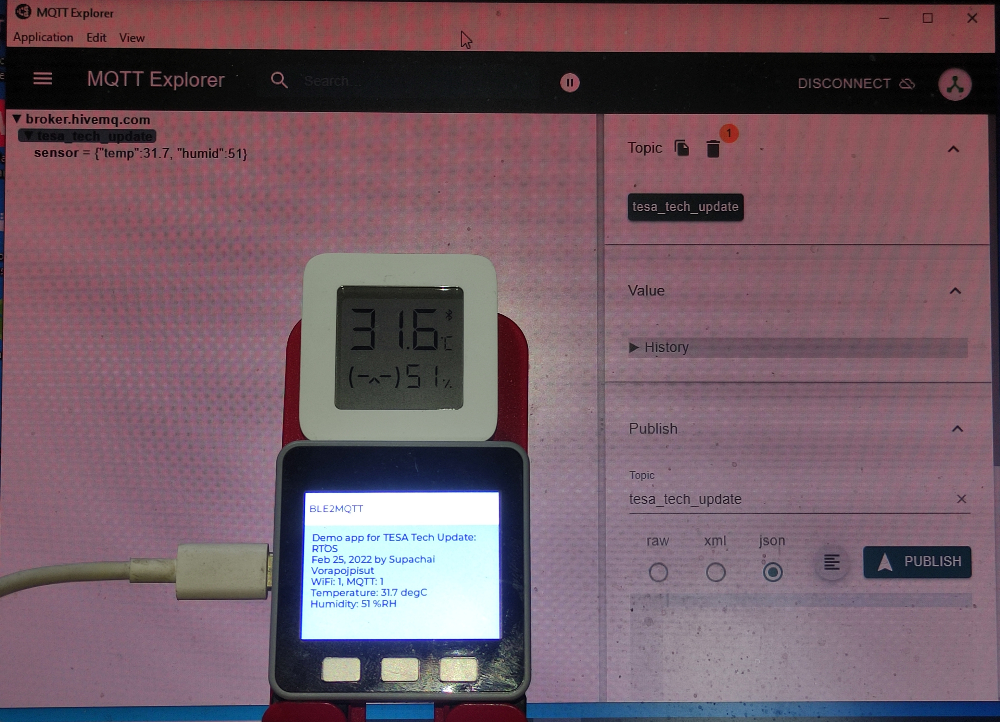

# ble2mqtt
ESP-IDF project that demonstrate firmware development using FreeRTOS on M5Stack device.

## Introduction
The project is C/C++ code for ESP32 processor that forward temperature and humidity values from Xiaomi Bluetooth Temperature and Humidity sensor to HiveMQ via MQTT protocol. I developed this example code for the TESA Tech Update event on Feb 25, 2022. Slides and record clip can be checked from [TESA website](https://www.tesa.or.th). The objective of this code is to show how to develop C/C++ for microcontroller using RTOS API. The hardware used is M5Stack core (ESP32) with ESP-IDF as the development toolchain. In addition to Bluetooth/WiFi/MQTT components, [LVGL driver](https://docs.lvgl.io/latest/en/html/get-started/espressif.html) is added as the GUI engine.

## Procedure
I had prepared this project using the following steps.
1. Install development tools: VS Code + ESP-IDF extension
2. Clone ESP32-port LVGL code: `git clone --recurse-submodules https://github.com/lvgl/lv_port_esp32.git ble2mqtt`
3. Setup LVGL for M5Stack
	1. Configure SDK: `idf.py menuconfig`
	2. Set Component config > LVGL configuration > resolution 320x240 and swap RGB565 bytes
	3. Set Component config > LVGL configuration > LVGL TFT Display controller > predefined M5Stack and landscape orientation
	4. Build and deploy to verify
4. Enable Bluetooth
	1. Configure SDK: `idf.py menuconfig`
	2. Set Component config > Bluetooth > enable BLE and Bluedroid

## Coding approach
There are 4 C-code files for main application, BLE GATT handler, WiFI+MQTT connection, and GUI.
1. **main.c** contains `app_main()` that initialize and run main loop.
	1. initialize BLE-GATT and WiFi-MQTT connections.
	2. create GUI task on core 1.
	3. loop that updating (non-blocking) network status (via EventGroup), sensor values (via Queue), and update text to show on GUI (with Mutex lock).
2. **ble_gatt.c** contains code for BLE GAP and GATT event handlers.
	1. initialize by registering GAP and GATT event handlers.
	2. GAP event handler on `ESP_GAP_BLE_SCAN_RESULT_EVT` event, open GATT connect to BLE device.
	3. GATT event handler on `ESP_GATTC_DIS_SRVC_CMPL_EVT` event, start scanning for matched service UUID (`REMOTE_SERVICE_UUID[ESP_UUID_LEN_128] = {0xA6, 0xA3, 0x7D, 0x99, 0xF2, 0x6F, 0x1A, 0x8A, 0x0C, 0x4B, 0x0A, 0x7A, 0xB0, 0xCC, 0xE0, 0xEB}`).
	4. GATT event handler on `ESP_GATTC_SEARCH_CMPL_EVT` event, if matched service is found, check for matched characteristics UUID (`REMOTE_NOTIFY_CHAR_UUID[ESP_UUID_LEN_128] = {0xA6, 0xA3, 0x7D, 0x99, 0xF2, 0x6F, 0x1A, 0x8A, 0x0C, 0x4B, 0x0A, 0x7A, 0xC1, 0xCC, 0xE0, 0xEB}`) and register notification.
	3. GATT event handler on `ESP_GATTC_NOTIFY_EVT` event, extract sensor data from payload and send to main loop via Queue object.
3. **wifi_mqtt.c** contains code for WiFi and MQTT connection.
	1. initialize by registering WiFi event handler.
	2. WiFi event handler on `IP_EVENT/IP_EVENT_STA_GOT_IP/`, notify main loop with EventGroup and start MQTT connection.
	3. MQTT event handler on `MQTT_EVENT_CONNECTED`, notify main loop with EventGroup.	
4. **gui.c** contains code for GUI task.
	1. initialize driver and buffer for LVGL and register timer tick callback.
	2. loop update text on GUI (with Mutex lock).

## How to use this example project
1. Clone this repository.
2. Use VS Code with ESP-IDF extension to open folder.
3. Modify WiFi setting (SSID/password) and MQTT topic in **wifi_mqtt.c**.
4. Build and deploy to M5Stack Core.

## References
1. [Example code for LVGL port for ESP32.](https://github.com/lvgl/lv_port_esp32)
2. [Example code for ESP32 GATT connection.](https://github.com/espressif/esp-idf/tree/master/examples/bluetooth/bluedroid/ble/gatt_client)
3. [Example code for ESP32 WiFi in stationary mode.](https://github.com/espressif/esp-idf/tree/master/examples/wifi/getting_started/station).
4. [Example code for ESP32 MQTT connection.](https://github.com/espressif/esp-idf/tree/master/examples/protocols/mqtt/tcp)